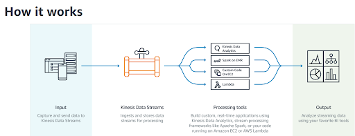
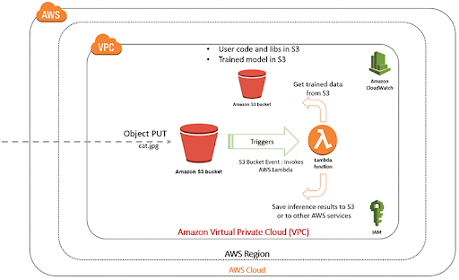

# Catastrophe
Cloud project using AWS to do real-time cat detection from a subreddit.

# Architecture

# Tasks
  - Finish training model
  - Kinesis: Getting URL from Reddit (https://im.reddit.com/r/aww/)
      - https://boto3.amazonaws.com/v1/documentation/api/latest/reference/services/kinesis.html
      - https://aws.amazon.com/blogs/big-data/snakes-in-the-stream-feeding-and-eating-amazon-kinesis-streams-with-python/
      - https://praw.readthedocs.io/en/latest/getting_started/quick_start.html
      - https://github.com/reddit-archive/reddit/wiki/OAuth2
      - https://www.reddit.com/r/learnpython/comments/5benxs/how_do_i_download_an_image_using_praw/
      - https://www.arundhaj.com/blog/getting-started-kinesis-python.html
      - https://praw.readthedocs.io/en/latest/tutorials/reply_bot.html
  - Lambda Function 1: getting image from kinesis url
      - https://docs.aws.amazon.com/lambda/latest/dg/with-kinesis-example.html
      - Put images into S3 using lambda https://medium.com/think-serverless/image-upload-and-retrieval-from-s3-using-aws-api-gateway-and-lambda-b4c2961e8d1
      
      
      
      - How kinesis works:
      
      
      
      - Deep Learning with Lambda:
      
      
      
      - Real-time + batch processing (front end):
      - Goals of Project
      - Code to be written
          - Input for Kinesis Data Stream, presumably there’s a Reddit API
          - Lambda: trigger upon new post, analyze image using the trained model, store analysis 
      - Schedule
          - Task assignments to each team member
          - Risk and expected results
  - Dataset: complete by 11/14
      - Size: how many images to use for testing/validation
      - Testing data: (which years should we choose?)
      - Validation data: (which years should we choose?)
      - Testing data: real-time analysis on reddit posts
  - Machine Learning Flowchart Elements
      - Data acquisition: Scrape subreddit of choosing ( it seems reddit.com/r/aww would have the most wholesome content and pretty consistently is an image)
      - Data Cleaning: retain imgur and reddit images links, download images with a script

  - Some resources to clarify anything that occurs, hopefully:
      - Just a general tutorial site: https://machinelearningmastery.com/
      - Re-training: https://www.tensorflow.org/hub/tutorials/image_retraining
      - Pikachu detection, pretty good explanation of everything: https://towardsdatascience.com/detecting-pikachu-on-android-using-tensorflow-object-detection-15464c7a60cd
      - The way I think is best to collect cute animal pictures: 
          - http://www.storybench.org/how-to-scrape-reddit-with-python/
      - For architecture considerations: 
          - https://aws.amazon.com/blogs/machine-learning/how-to-deploy-deep-learning-models-with-aws-lambda-and-tensorflow/
          - https://medium.freecodecamp.org/what-we-learned-by-serving-machine-learning-models-using-aws-lambda-c70b303404a1
      - Kinesis to lambda: 
          - https://stackoverflow.com/questions/51281581/using-the-partition-key-in-kinesis-to-guarantee-that-records-with-the-same-key-a
  - Other stuff:
      - Cat DataSet:
          - https://www.kaggle.com/crawford/cat-dataset
      - CatNet
          - https://github.com/fdalvi/cat-detector
