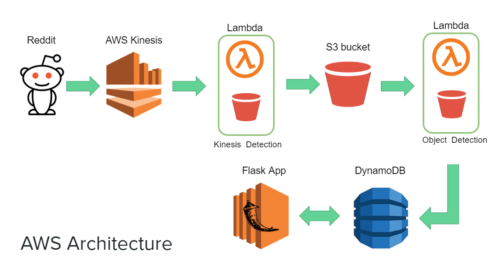
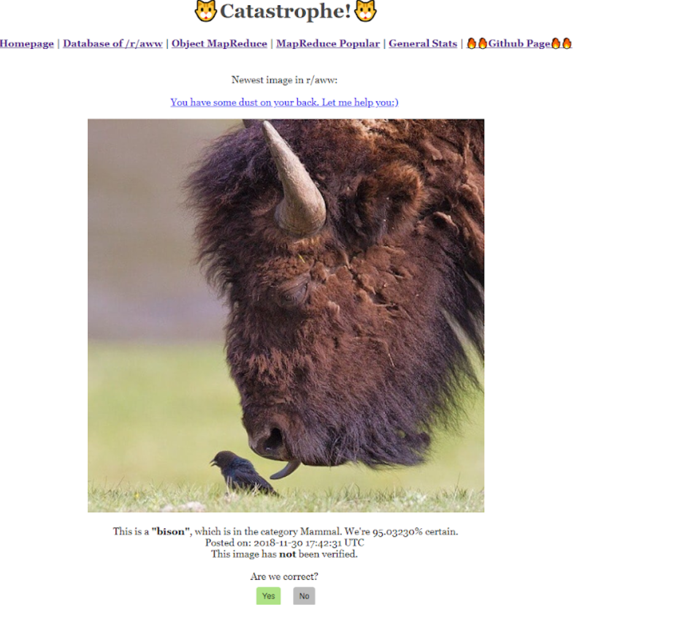

# Catastrophe
Cloud project using AWS to do real-time cat detection from a subreddit.

# Architecture


# Setup
1. Set up a AWS Lambda function (import Lambda1.zip)  with Kinesis as a trigger writing to the S3 bucket.
2. Set up another AWS Lambda function (Lambda 2) with the S3 bucket as a trigger writing to a dynamodb.

# Execution
To run locally: 
   ``` python kinesis.py ```
 
# Website 
This is what our website looks like running live.

